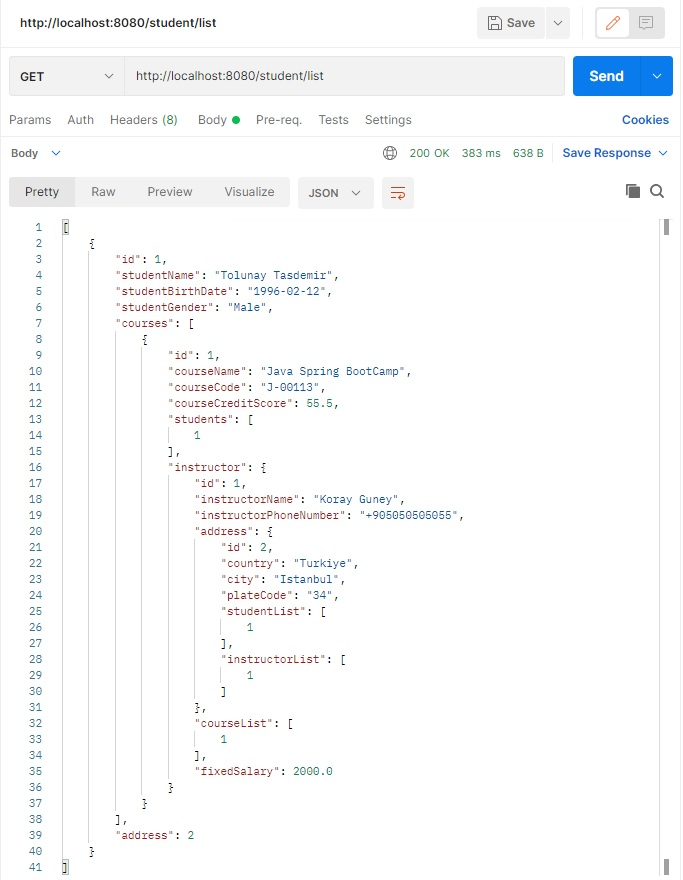
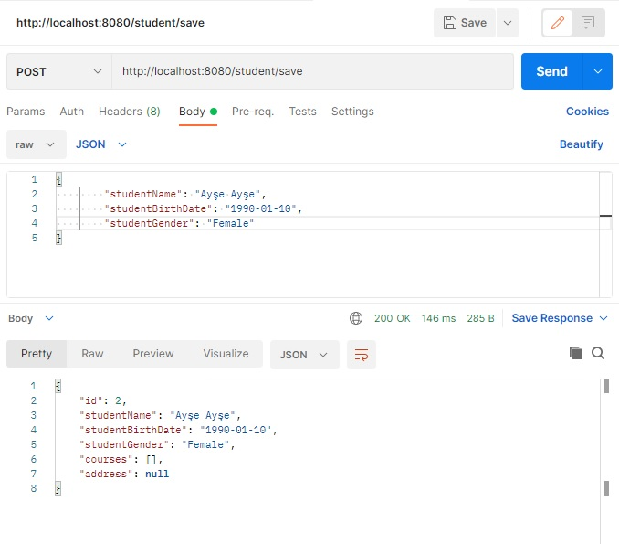
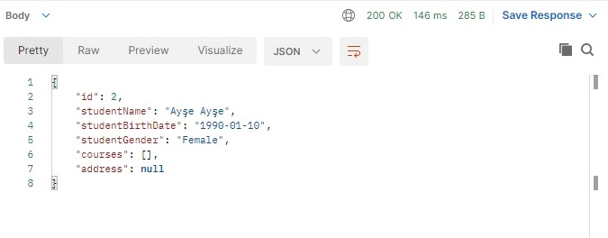
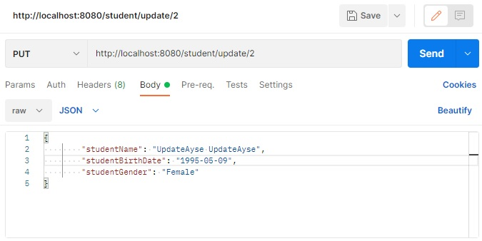
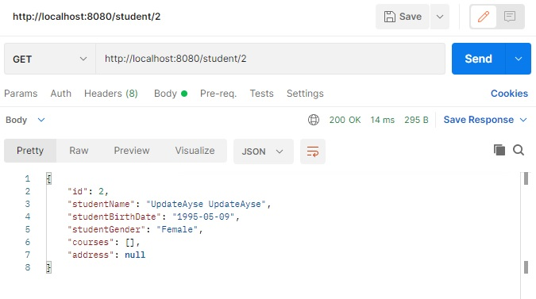
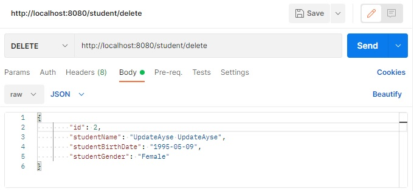

## Description

---
- The second project of Gitti Gidiyor Java Spring Bootcamp by patika.
- Database of a school management system has been created.
- Mysql is used as the database system.
- The connection of the project with mysql is made using spring boot hibernate.
- Querying, updating and deleting operations can be performed With Spring Boot Get, Post, Put and Delete mapping.
- The design of the project was made in accordance with the UML diagram.
- Postman application was used to perform Get, Post, Put and Delete mapping operations.

## School Management System UML Diagram

---

## Mapping Operations Examples

---
- Examples are given from the student class.

### Get Mapping

-  Get request for all student list.

### Post Mapping

- Post request for save a Student.

### Put Mapping

Before Update

Update process

- The data in the entered id value is updated with the new values.

After Update

### Delete Mapping

- Data with entered values is deleted.

## Second Project

